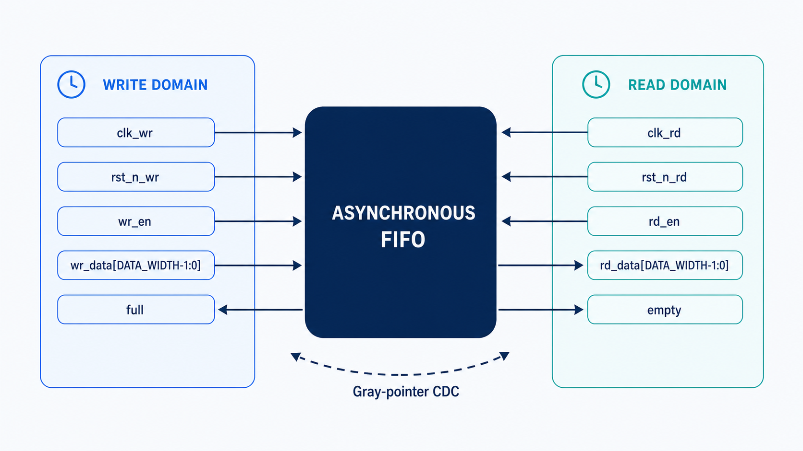
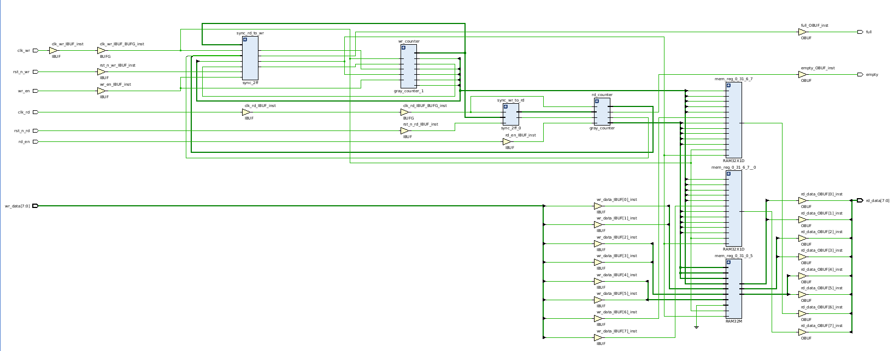

<div align="center">

# Asynchronous FIFO

**A parameterized dual-clock FIFO with Gray-coded clock-domain crossing, two-flop synchronizers, and self-checking verification.**

[](rtl/)
[](https://github.com/vohoangnguyennnn/Asynchronous-FIFO/actions/workflows/rtl-lint.yml)
[](docs/report.md)
[](docs/report.md)
[](LICENSE)

</div>



## Overview

This repository implements an asynchronous FIFO in synthesizable SystemVerilog.
It transfers ordered data between independent write and read clock domains while
keeping all multi-bit pointer comparisons local to their destination domains.

The design uses binary pointers for memory addressing and converts them to Gray
code before clock-domain crossing. Because only one Gray-code bit changes between
adjacent pointer values, each pointer can be sampled through a two-flop
synchronizer without exposing a multi-bit binary transition directly to the
other clock domain.

### Highlights

- Independent write and read clocks with independent active-low resets
- Parameterized data width and FIFO depth
- Dual-port storage with first-word-fall-through read behavior
- `ADDR_WIDTH + 1`-bit pointers for address tracking and wrap detection
- Binary-to-Gray conversion before crossing clock domains
- Two-flop synchronizers in both CDC directions
- Full and empty protection for rejected overflow and underflow requests
- Self-checking testbench with a queue-based scoreboard
- Directed boundary tests, concurrent random traffic, and pointer wrap-around
- SystemVerilog assertions for one-bit Gray-pointer transitions

## Architecture

The FIFO is split into write-domain logic, read-domain logic, dual-port memory,
and two CDC synchronizer paths.

| Write clock domain | Clock-domain crossing | Read clock domain |
| --- | --- | --- |
| Accepts writes when `wr_en && !full` | Synchronizes `wr_gray` into `clk_rd` | Accepts reads when `rd_en && !empty` |
| Advances `wr_bin` and `wr_gray` | Synchronizes `rd_gray` into `clk_wr` | Advances `rd_bin` and `rd_gray` |
| Generates `full` from synchronized read state | Uses two destination-clock flip-flops | Generates `empty` from synchronized write state |
| Writes memory at the binary write address | Gray encoding limits adjacent changes to one bit | Reads memory at the binary read address |

The local status comparisons are:

```systemverilog
empty = (rd_gray == wr_gray_sync_to_rd);

full  = (wr_gray == {
  ~rd_sync_gray_to_wr[ADDR_WIDTH:ADDR_WIDTH-1],
   rd_sync_gray_to_wr[ADDR_WIDTH-2:0]
});
```

Equal Gray pointers indicate an empty FIFO. A full FIFO is detected by matching
the lower Gray-pointer bits while inverting the two most-significant bits of the
synchronized read pointer, which represents a separation of one complete FIFO
depth.

### Synthesized schematic

The synthesized view shows the two pointer counters, both synchronizers, flag
logic, and the inferred memory structure.



## Parameters

| Parameter | Default | Description |
| --- | ---: | --- |
| `DATA_WIDTH` | `8` | Width of each stored data word |
| `ADDR_WIDTH` | `5` | Number of address bits |
| FIFO depth | `2**ADDR_WIDTH` | Number of stored words; 32 entries by default |
| Pointer width | `ADDR_WIDTH + 1` | Address plus wrap-tracking bit |

The verification environment overrides `ADDR_WIDTH` to `4`, producing a
16-entry FIFO for the tested configuration.

## Interface

| Signal | Direction | Clock domain | Description |
| --- | --- | --- | --- |
| `clk_wr` | Input | Write | Write-domain clock |
| `rst_n_wr` | Input | Write | Active-low asynchronous write-domain reset |
| `wr_en` | Input | Write | Write request; accepted only while `full == 0` |
| `wr_data` | Input | Write | `DATA_WIDTH`-bit input data |
| `full` | Output | Write | Prevents writes when the FIFO has no free entry |
| `clk_rd` | Input | Read | Read-domain clock |
| `rst_n_rd` | Input | Read | Active-low asynchronous read-domain reset |
| `rd_en` | Input | Read | Read request; accepted only while `empty == 0` |
| `rd_data` | Output | Read | Current word at the read pointer |
| `empty` | Output | Read | Prevents reads when no valid entry is available |

`rd_data` uses first-word-fall-through behavior and is only meaningful while
`empty == 0`. The memory itself is not reset, so an unknown `rd_data` value while
the FIFO is empty is expected in simulation.

## Verification

The self-checking testbench drives requests on falling clock edges and observes
accepted transactions on rising edges to avoid simulation races. A shared queue
scoreboard records every accepted write and checks every accepted read for
ordering and data integrity.

| Test | What it verifies |
| --- | --- |
| Reset state | Empty/full flags and pointer initialization |
| Directed fill and drain | FIFO ordering across every entry |
| Overflow attempt | A blocked write does not advance the write pointer |
| Underflow attempt | A blocked read does not advance the read pointer |
| Concurrent random traffic | Independent-clock operation under simultaneous activity |
| Pointer wrap-around | Correct behavior beyond one complete FIFO depth |
| Gray-pointer assertions | Each local Gray pointer changes by zero or one bit per update |

Tested with Questa Altera Starter FPGA Edition 2025.2 using an 8-bit,
16-entry FIFO, a 100 MHz write clock, and an approximately 71 MHz read clock.
The fixed-seed regression completed with all 206 accepted writes matched by 206
accepted reads:

```text
PASS: reset state
PASS: fill/drain ordering and boundary protection
PASS: concurrent random traffic and pointer wrap-around
TEST PASSED - writes=206 reads=206
Errors: 0, Warnings: 0
```

[](docs/report.md)

The detailed report contains the complete test configuration, annotated
QuestaSim waveforms, compilation evidence, and regression results. Waveform
images are intentionally kept out of this top-level README.

GitHub Actions runs Verilator lint on the synthesizable RTL for every push and
pull request to `main`. The complete behavioral regression remains a QuestaSim
flow because the testbench uses simulator features that are not part of the
open-source CI job.

> RTL simulation validates functional CDC behavior but does not model analog
> metastability. Production sign-off still requires dedicated CDC analysis and
> timing constraints appropriate to the target technology.

## Run the simulation

### Requirements

- QuestaSim or Questa Altera Starter FPGA Edition
- GNU Make
- `vlib`, `vlog`, `vsim`, and `vdel` available in `PATH`

From the repository root:

```bash
# Compile RTL and the testbench
make -C sim compile

# Run the complete regression in terminal mode
make -C sim sim

# Open QuestaSim with preconfigured signals
make -C sim gui

# Remove the compiled work library
make -C sim clean
```

## Repository structure

```text
.
├── .github/
│   └── workflows/rtl-lint.yml  # Automated Verilator RTL lint
├── rtl/
│   ├── async_fifo.sv       # Top-level FIFO, memory, and flag logic
│   ├── gray_counter.sv     # Binary and Gray-code pointer counter
│   └── sync_2ff.sv         # Parameterized two-flop synchronizer
├── verification/
│   └── async_fifo_tb.sv    # Self-checking testbench and assertions
├── sim/
│   ├── Makefile            # Compile, simulation, GUI, and clean targets
│   └── questa.do           # QuestaSim setup and waveform configuration
├── docs/
│   ├── images/             # Architecture, synthesis, and simulation evidence
│   └── report.md           # Detailed verification report and waveforms
├── LICENSE
└── README.md
```

## Scope

This project demonstrates the RTL architecture and functional verification of a
parameterized asynchronous FIFO. The included regression covers one parameter
configuration, one clock ratio, and one deterministic random seed. It does not
replace target-specific synthesis checks, static timing analysis, or structural
CDC sign-off.

## License

This project is released under the [MIT License](LICENSE). Copyright © 2026
Vo Hoang Nguyen.
