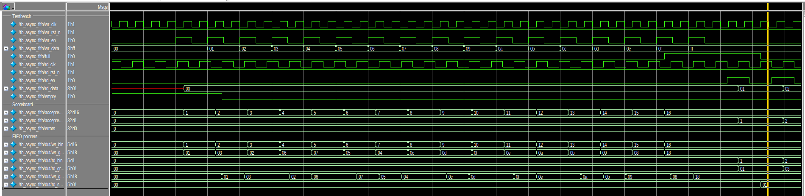
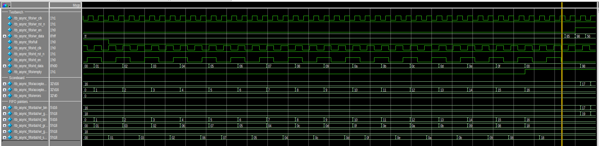
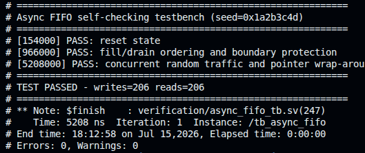

# QuestaSim Verification Report

This report summarizes the simulation results of the asynchronous FIFO. Design
architecture and repository usage are documented in the main
[`README.md`](../README.md).

## Test configuration

| Setting | Value |
| --- | --- |
| Simulator | Questa Altera Starter FPGA Edition 2025.2 |
| Data width | 8 bits |
| FIFO depth | 16 entries |
| Write clock | 100 MHz |
| Read clock | Approximately 71 MHz |
| Random cycles | 400 |
| Random seed | `32'h1A2B_3C4D` |

The testbench drives FIFO inputs on falling clock edges and samples accepted
transactions on rising edges. A queue-based scoreboard records every accepted
write and compares it against each accepted read.

## Tests performed

### Reset state

After reset, the testbench checks that:

- `empty` is asserted.
- `full` is deasserted.
- Both binary pointers are zero.

### Directed boundary test

The testbench writes values `8'h00` through `8'h0F`, filling all 16 FIFO
entries. It then checks that `full` is asserted and attempts one additional
write with `8'hFF`. The write pointer must remain unchanged, proving that the
overflow attempt was blocked.

All 16 entries are then read and compared with the scoreboard. After the final
read, `empty` must assert. An additional read request must not advance the read
pointer.

#### Fill, full, and overflow



The write waveform shows values `8'h00` through `8'h0F` being accepted in order.
`wr_bin` and `accepted_writes` advance together to 16, and `full` asserts after
the final free entry is consumed. During the following `8'hFF` overflow attempt,
the accepted-write count and write pointer remain unchanged. The synchronized
write Gray pointer follows its source after read-domain CDC latency.

#### Drain, empty, and underflow



The read waveform shows the stored sequence `8'h00` through `8'h0F` being
drained in order. `accepted_reads` and `rd_bin` advance together to 16, after
which `empty` asserts. The subsequent underflow attempt does not advance the
read pointer. The activity at the far right begins the concurrent random phase;
it is not part of the directed drain. `errors` remains zero throughout the
directed test.

The initial unknown value on `rd_data` is expected because the memory is not
reset and the FIFO is empty. `rd_data` is only checked during an accepted read.

### Concurrent random traffic

Write and read enables are randomized while the two clocks run independently.
The phase continues long enough to exercise pointer wrap-around. After random
traffic stops, the remaining entries are drained and checked against the
scoreboard.

The test passes only when:

- More than one additional FIFO depth has been written.
- Accepted read and write counts are equal.
- The scoreboard is empty.
- No data mismatch or Gray-pointer assertion has occurred.

## Regression result

The RTL and testbench compiled with zero compiler errors and warnings. The
complete simulation produced:

```text
PASS: reset state
PASS: fill/drain ordering and boundary protection
PASS: concurrent random traffic and pointer wrap-around
TEST PASSED - writes=206 reads=206
Errors: 0, Warnings: 0
```



All 206 accepted writes were matched by 206 accepted reads. The fixed-seed
regression completed at approximately 5.208 microseconds of simulation time.

## Reproducing the simulation

From the repository root, run:

```bash
# Terminal regression
make -C sim sim

# QuestaSim GUI with preconfigured waveforms
make -C sim gui

# Remove the compiled work library
make -C sim clean
```

The commands `vlib`, `vlog`, `vsim`, and `vdel` must be available in `PATH`.

## Scope

This simulation verifies FIFO ordering, boundary protection, pointer
wrap-around, and concurrent operation for one parameter configuration, clock
ratio, and random seed. RTL simulation does not model analog metastability and
does not replace dedicated CDC or static-timing analysis.
